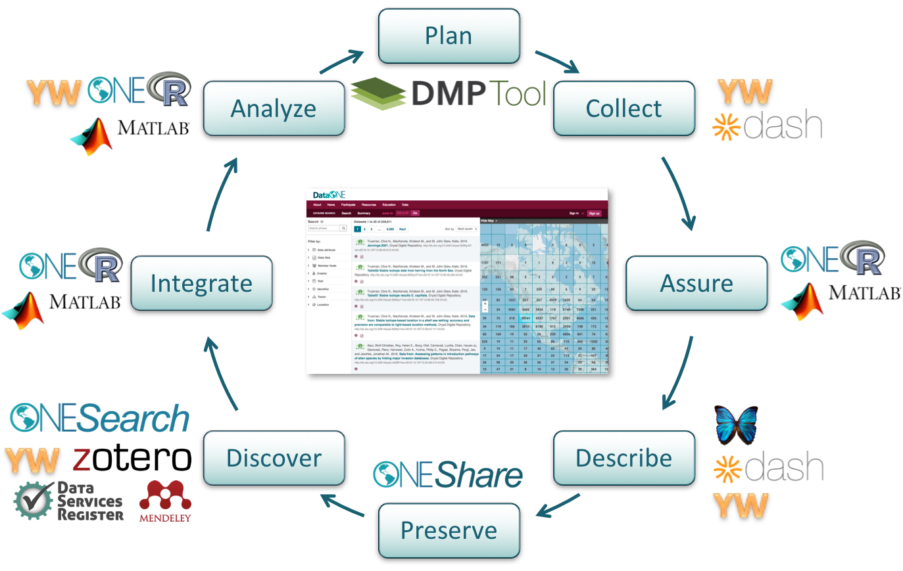
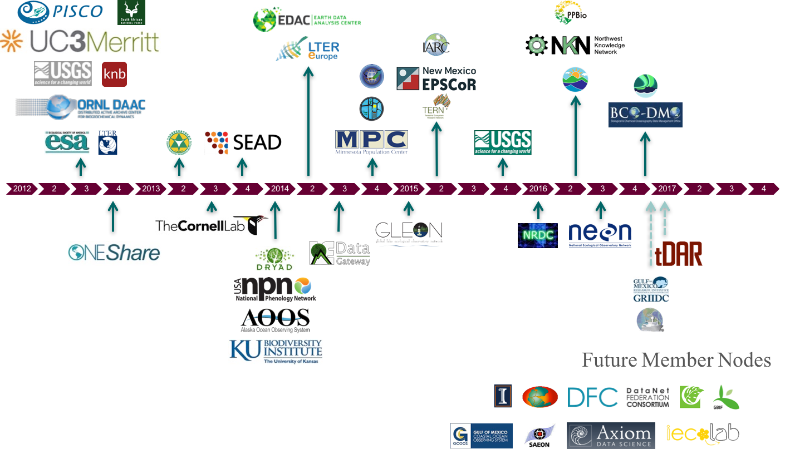
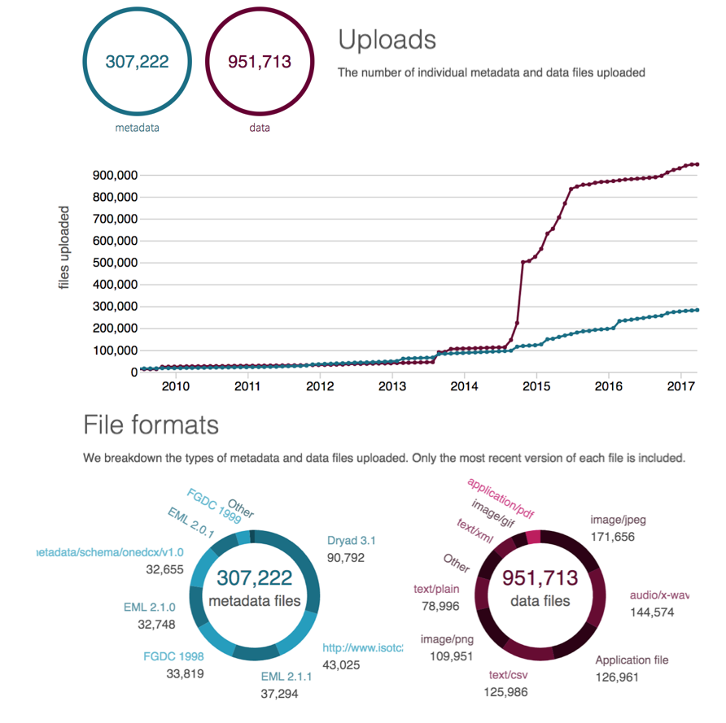
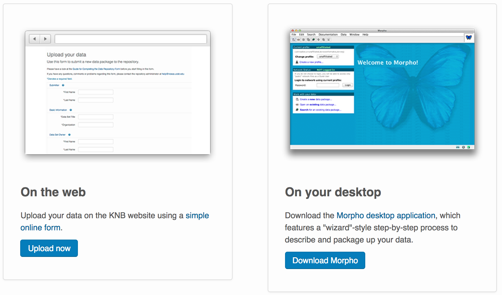

Morpho Quick Starting Guide
======================================================

## Context

The goal of this tutorial is to introduce tools to help you to preserve and share your data.

*See also: <https://www.dataone.org/education-modules>*

We will see how to best describe and document your data using a standardized **metdata format** called **Ecological Metadata Language ([EML](https://knb.ecoinformatics.org/#external//emlparser/docs/index.html))**. In a nutshell, EML is a xml document using a specific schema.

Describing your data is only part of the data preservation process, you also need to deposit your data and metadata (often called a **data package**) in a **long-term data repository** to enable others to discover and reuse your data. In general, data repositories have the capacity to leverage standardized metadata to expose information about a specific set of data to the user. It also enables data discovery through search engine by mining the metadata content. In this tutorial, we are going to use NCEAS data repository the Knowledge Network for Biocomplexity ([KNB](https://knb.ecoinformatics.org/#)).

The KNB is a member node of the NSF founded **Data Observation Network for Earth ([DataONE](https://www.dataone.org/))**. DataONE is a confederation of data repositories (called member nodes) - currently 36 and counting.

 

DataONE is a great tool for data discovery allowing you to search for data across all the member data repositories: <https://search.dataone.org> 

## Tutorial

We are going to go over two tools that we can use to assist us in creating the EML metadata document: 

- Webform
- Desktop application: Morpho 

 

Then we will upload our data to the developer site of the KNB (sandbox): <https://dev.nceas.ucsb.edu/#>

Note that there are also other tools available to create EML, data packages and interact with DataONE API, such as the R packages on rOpenSci: <https://ropensci.org/packages/>

## Downloading Morpho 
 
Download the latest version of Morpho, [Morpho 1.11.0][], from the KNB website. To run Morpho, users must have [Java 1.7][] or later installed on their computers.  

[Morpho 1.11.0]: https://knb.ecoinformatics.org/#tools/morpho
[Java 1.7]: http://www.oracle.com/technetwork/java/javase/downloads/jdk7-downloads-1880260.html

## Creating a User Account  

Before creating a Morpho profile, users must create a KNB account through the [KNB signup page][]. When creating a KNB account, fill out all of the necessary information. In almost all cases, users should select from the dropdown **KNB/AOOS** as their organization. Once a KNB account is created, users are ready to create a Morpho profile. Open the Morpho program and select the **Create a new profile…** option on the startup screen.  

**Note**: Users do not need to log in to create metadata for personal use only. This metadata can be saved locally instead of in the Metacat repository.

To create a new profile, on the first page, users will enter a profile name and basic information.  

![][new_profile_1]

On the next page users will enter a username. This username must be the same username as the KNB account. The username can also be the same as the Morpho profile name, as long as it matches the KNB account. *For **Organization** users should select **unaffiliated** from the dropdown options.*

![][new_profile_2]

On the last page, users will enter a prefix for data package identification. All data packages created under the profile will be saved with the identifier prefix. A list of unacceptable characters is provided on the page.  

![][new_profile_3]

Next, users will want to set the preferences for their profile by selecting the correct ‘Metacat URL’ (**File -> Set preferences...**). 

![][new_profile_4]

Any user who would like a test environment for practicing data entry can use the dev URL (**https://dev.nceas.ucsb.edu/knb/metacat**), as below. However, be aware that there is no guarantee that the content uploaded in this scratch space will be available or secure, so it would be best to test using public data only. Additionally, the server may be down periodically for short amounts of time. 

![][new_profile_5]

For actual use with the KNB, users should enter the following link:
**https://knb.ecoinformatics.org/knb/metacat**

Once those preferences are set users may login to their profile using their profile name and the same password used to access their KNB account.  

To receive a more detailed introduction and overview of Morpho, users can click on the ‘Help’ tab and view the “Morpho User Guide”, “Intro to Metadata”, and “EML Specifications” documents.  

[KNB signup page]: https://knb.ecoinformatics.org/#signup

[new_profile_1]: ./morpho_images/new_profile_1.png
[new_profile_2]: ./morpho_images/new_profile_2.png
[new_profile_3]: ./morpho_images/new_profile_3.png
[new_profile_4]: ./morpho_images/new_profile_4.png
[new_profile_5]: ./morpho_images/new_profile_5.png

## Creating a New Data Package  

A new data package must be created to add data or metadata that is not part of an already existing package. To create a new data package, users may click the **Create a new data package…** option or the **new data package** icon.  

![][new_package_1]

Both options will lead the user to the New Data Package Wizard where users can follow a step-by-step prompt for filling out the metadata template. At any point users can save their work and exit the New Data Package Wizard by selecting the **Save for Later** button at the bottom left corner of the page. At the end of the prompt, there is an opportunity to add a new data table. Users may also complete the new data package with only the metadata. Users can add, edit, or describe data in a data package at a later time by opening an existing data package and then selecting one of the options from the **Data** tab, which is also where users can edit their metadata.  

![][new_package_2]

[new_package_1]: ./morpho_images/new_package_1.png
[new_package_2]: ./morpho_images/new_package_2.png

## Batch Data Uploads  

If importing many similar data tables into one data package, it is best to first create a **metadata template** by entering all of the metadata information.  This creates the data package that users can now import a data table into. Once this is done, users can duplicate the data package (**File -> Save Duplicate**), change any general metadata, and then replace the original table with a new, but very similar, table (**Data -> Replace data**). Please be sure to verify that the attribute-level metadata still lines up exactly with the new table.  

![][batch_data_1]
![][batch_data_2]

[batch_data_1]: ./morpho_images/batch_data_1.png
[batch_data_2]: ./morpho_images/batch_data_2.png

## Creating Multiple Data Packages with Similar Metadata

Users who would like to create multiple data packages with similar metadata may first want to create a template using the New Data Package Wizard. Once that data package has been created, users have the option of duplicating that data package, as shown in the step above. Once duplicated, the data package is saved locally under a new identifier. Users can then make edits to the metadata in the Morpho Editor (**Documentation -> Add/Edit Documentation**).  

![][similar_metadata_1]

In the Morpho Editor users will want to select from the **Find** dropdown the metadata section they are interested in changing. Once the changes are made, users can hit the **OK** button in the bottom right corner. This creates a new metadata package that is automatically saved locally.  

![][similar_metadata_2]

Users can save the package to the network (**File -> Save**) by selecting the **Save to Network** option.  

![][similar_metadata_3]

[similar_metadata_1]: ./morpho_images/similar_metadata_1.png
[similar_metadata_2]: ./morpho_images/similar_metadata_2.png
[similar_metadata_3]: ./morpho_images/similar_metadata_3.png

For any questions regarding Morpho or KNB, please contact <help@nceas.ucsb.edu>.  
